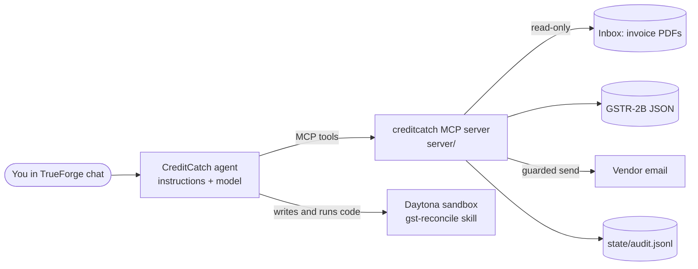

# CreditCatch

An agent that does a small Indian business's monthly GST purchase reconciliation. It reads the purchase invoices from the inbox, matches them against the GSTR-2B statement in a sandbox, shows how much input tax credit (ITC) is at risk, and emails vendors whose filings are wrong, but only after you approve each email.

Built on [TrueForge](https://trueforge.dev) for the TrueFoundry × Polaris "Agents That Act" hackathon, 26 September 2026.

## Write-up

**The problem.** Indian businesses can reclaim the GST paid on purchases (input tax credit, ITC) only for invoices their suppliers reported correctly in the monthly GSTR-2B statement. Accountants check every invoice by hand and chase the vendors who got it wrong. A missed mismatch is lost money.

**What the agent reaches.** Only our MCP server: a read-only inbox, the GSTR-2B file, the vendor master, and two write tools that email a vendor and save the ITC register. In a Daytona sandbox it runs the skill's scripts and code it writes itself, including a parser for invoice layouts the extractor won't guess at.

**Where it stops.** Vendor emails and the register save need human approval in TrueForge, and it asks when two invoice numbers only look alike. The server enforces limits regardless: vendors are named by GSTIN, never a typed address, one email each, and claims GSTR-2B doesn't support are refused. It works out the GSTR-3B Table 4 figures but never files them, and every call is logged.

**Architecture.** TrueForge agent → our FastMCP server → Daytona sandbox. Every rupee figure comes from code, and each invoice must pass an arithmetic check.

**How TrueForge was used.** It holds the agent's instructions, the `gst-reconcile` skill imported from GitHub, and our MCP connector with approval on both write tools. Code Mode lets sandbox scripts call tools without credentials, and our inbox watcher uses the session API to start a run when invoice mail arrives.

**Real vs mocked.** The TrueForge runs, sandbox code, MCP server and approvals are real, and so is Gmail mode over IMAP/SMTP. GSTR-2B is a saved file, since the portal API needs a licensed GSP. Invoices and vendors are generated, a new month for every seed.

**Known limits.** The MCP server has no auth of its own, so approvals exist only in TrueForge. Vendor addresses are plus-aliases of the demo inbox. It runs one company on flat files, and send limits reset with the inbox, not per run. B2B invoices only: no credit notes, reverse charge or OCR.

The same write-up is in [WRITEUP.pdf](WRITEUP.pdf). The rest of this README has the details and setup steps.

## Why this job

When a business buys something it pays GST to the supplier and can claim that tax back as ITC. It can only claim it if the supplier reported the same invoice to the government, which shows up in the buyer's monthly GSTR-2B statement. When an invoice is missing there, or the amount or tax head is wrong, the credit is lost until the supplier fixes it. Accountants match these by hand every month and then chase each vendor by email.

In the fixed demo month, CreditCatch finds **₹1,05,000 of ITC at risk** across 15 invoices from 8 vendors. Nothing about that month is special: give the demo any number and it generates a different month (another business, other vendors, amounts, invoice layouts and problems), and the agent has to work it out from scratch. See [Every month is different](#every-month-is-different).

## How it works



| Part | What it is |
|---|---|
| `server/` | The MCP server. Read tools for the inbox, GSTR-2B and vendor list. Two write tools, `send_vendor_email` and `save_itc_register`, marked destructive and guarded in code. Every call is logged to `state/audit.jsonl`. |
| `skills/gst-reconcile/` | The TrueForge skill: `SKILL.md` (the procedure), `extract.py` (invoice PDF to fields; refuses to guess on layouts it doesn't know), `check_books.py` (every invoice's arithmetic must add up), `gstin.py` (GSTIN checksum), `reconcile.py` (books vs GSTR-2B). |
| `agent/instructions.md` | The agent's system prompt. |
| `data/generate.py` | Builds the synthetic data: invoice PDFs in three layouts, the emails that carry them, a GSTR-2B file, a vendor master and an answer key. The fixed month is in `data/demo/`; `--seed N` makes a random one. |
| `scripts/seed_inbox.py` | Puts a month's emails into the inbox and resets the demo (`--seed N` for a random month). |

In a run, the agent writes a Python script that runs in the Daytona sandbox and pulls every PDF and the GSTR-2B through the MCP tools (TrueForge Code Mode, so no credentials enter the sandbox). It runs the skill's extractor, and when invoices arrive in a layout the extractor can't read, it reads the page text and writes a parser for that layout on the spot, then proves its output with `check_books.py` before anything is matched. It then reconciles, asks you about anything ambiguous, drafts one email per vendor, and saves the ITC register.

Saving the register also records the claims, split into IGST, CGST and SGST, in a small SQLite ledger (`state/creditcatch.db`), next to every invoice email the inbox has received. It then works out the GSTR-3B Table 4 figures (4A(5) eligible ITC, 4C net ITC, 4D(2) ineligible ITC) and writes them to `state/gstr3b_table4_<period>.json`. Those are the numbers to check against the auto-filled GSTR-3B on the GST portal. `python scripts/ledger.py` prints what's recorded. CreditCatch never files anything: entering the return on the portal stays with you.

## What it catches

| Finding | Example in the demo data |
|---|---|
| Invoice missing from GSTR-2B | `MS/0823`: the supplier never filed it |
| Value differs from GSTR-2B | `SP/26-27/0419`: ₹2,50,000 in books, ₹2,05,000 reported |
| Wrong tax head | `PBE/26/0057`: a Maharashtra supplier charged CGST+SGST to a Karnataka buyer |
| Invalid GSTIN on the invoice | `CFS/AUG/044`: fails the GSTIN checksum |
| Same invoice, different number format | `KFM-118` vs `KFM/2026-27/118`: you're asked to confirm |
| Duplicate in the inbox | `DDP/0902` forwarded twice, counted once |
| In GSTR-2B but not in books | `SST/774`: reported by the supplier, never received |
| Billed to the wrong GSTIN | random months: an invoice made out to the buyer's registration in another state |
| ITC marked not available in GSTR-2B | random months: the portal lists the invoice with `itcavl: N` |
| Not an invoice | random months: a price list or a statement of account in the inbox, set aside |

## Every month is different

```bash
python scripts/seed_inbox.py --reset --seed 42        # or --seed random
```

This generates a new month into `state/scenario/` and loads it into the inbox; the running MCP server serves it straight away. Each seed picks one of four businesses (a bakery in Bengaluru, a garment maker in Tiruppur, a café in Hyderabad, a print shop in Pune), 6 to 10 of its vendors, 7 to 19 invoices with their own numbering styles and file names, and a random set of the problems above. Invoices come in three layouts: a plain one, a modern one, and one laid out like a Tally print, where labels and values sit in separate grid cells. The extractor can't read that one and says so, so the agent writes a parser for it live in the sandbox.

The answer key for the month is in `state/scenario/answer_key.json`, written from what was planted rather than from running the reconciler, so you can check the agent's numbers against it. `python tests/test_scenarios.py` runs the skill's scripts over 40 random months and checks each one against its key. A plain `--reset` goes back to the fixed month.

## Safety boundaries

**Held for a human in TrueForge:** every `send_vendor_email` and `save_itc_register` call, plus a question whenever two invoices only look alike.

**Enforced by the server, whatever the model or the approver does:**
- The agent never types an email address. It names a vendor by GSTIN and the server looks up the address in the vendor master. Unknown GSTINs are refused.
- In demo mode the recipient must be a plus-alias of the demo inbox, so nothing can reach a real company.
- One email per vendor per run, and at most `MAX_EMAILS_PER_RUN` in total. Every invoice number the email is about must appear in its body.
- `save_itc_register` refuses any claim that isn't in that period's GSTR-2B, that claims more tax than GSTR-2B shows, or that GSTR-2B marks as ITC not available.
- The extractor never guesses a field it can't tie to a label, and `check_books.py` rejects any invoice whose numbers don't add up, so a mis-read invoice can't reach the reconciliation.
- The inbox is opened read-only and fetched with `BODY.PEEK`, so nothing is even marked read. There is no delete tool and no tool that edits the books.
- Model and mail credentials stay on the TrueForge server and in `.env`; the sandbox only receives tool results.
- Every tool call, allowed or refused, is appended to `state/audit.jsonl`.

## Run it

You need Python 3.11+, Node 22.14+, a Daytona API key (permissions below), and an API key for a model TrueForge supports.

### 1. Start the MCP server

```bash
git clone https://github.com/divyansh0-ai/creditcatch.git
cd creditcatch
python -m venv .venv && source .venv/bin/activate
pip install -r requirements.txt
cp .env.example .env              # MAIL_BACKEND=local works with no accounts
python data/generate.py           # rebuilds data/demo (already committed)
python scripts/seed_inbox.py --reset
python -m server                  # http://127.0.0.1:8000/mcp
```

On Windows PowerShell:

```powershell
git clone https://github.com/divyansh0-ai/creditcatch.git
cd creditcatch
python -m venv .venv
.venv\Scripts\Activate.ps1
pip install -r requirements.txt
copy .env.example .env
python scripts/seed_inbox.py --reset
python -m server
```

If `python -m server` says the port is in use (`WinError 10048` on Windows), a server is already running on port 8000. Use that one or stop it first.

Check it without a model (in a second terminal):

```bash
python tests/e2e_mcp.py           # downloads every PDF over MCP, reconciles, tests the guards
```

### 2. Set up TrueForge

TrueForge blocks connectors on `localhost` by default, so start it with its network policy relaxed. Otherwise adding the connector fails with `Outbound URL blocked for host localhost`.

```bash
NETWORK_POLICY_ENABLED=false npx @truefoundry/trueforge@latest     # opens http://localhost:8790
```

On Windows PowerShell, set the variable in the same window first:

```powershell
$env:NETWORK_POLICY_ENABLED="false"
npx @truefoundry/trueforge@latest
```

1. **Settings → Models:** add your model provider.
2. **Settings → Sandbox providers:** add Daytona with your API key. The key needs `write:sandboxes`, `write:snapshots` and `delete:snapshots` (a Full access key works); with less, setup fails with "missing required permissions". The first setup builds a snapshot and takes a few minutes.
3. **Settings → Connectors → Add MCP Server:** name `creditcatch`, URL `http://localhost:8000/mcp`, no auth.
4. **Settings → Skills:** repository `https://github.com/divyansh0-ai/creditcatch`, path `skills/gst-reconcile`, ref `main`. The repository has to be public for TrueForge to fetch it.
5. **Build Agent:**
   - Name `creditcatch`, pick your model, and paste `agent/instructions.md` as the instructions.
   - Attach the `creditcatch` connector with all tools, and set **require approval** for `send_vendor_email` and `save_itc_register`.
   - Add the `gst-reconcile` skill. Turn on the sandbox, clarifying questions, and file downloads.
   - Click **Save Agent**.
6. Check the approval gates: `python scripts/export_agent.py` reads the saved agent from TrueForge, says whether both write tools pause for approval, and saves its setup to `agent/creditcatch.agent.json`. It refuses to write the file if it spots anything that looks like a secret.
7. Open a chat with the agent and send: **Reconcile our August 2026 purchases.**

### 3. Let new invoice emails start the agent (optional)

Save the agent in Build Agent (**Save Agent**; TrueForge stores the name in lowercase, e.g. `creditcatch`), then in a third terminal:

```bash
python scripts/watch_inbox.py              # --agent <saved name> if it isn't "creditcatch"
```

It watches the same inbox the MCP server reads. When emails with PDF attachments arrive, it waits for the batch to settle (20 seconds without new mail), opens a new TrueForge session with the agent, tells it what arrived, and opens that session in your browser. Vendor emails and the ITC register still wait there for your approval. Reseeding the inbox (`seed_inbox.py --reset --seed N`) counts as new mail, and so does anyone emailing an invoice to the Gmail inbox. The watcher only reads mail.

### 4. Use a real Gmail inbox (optional)

Make a throwaway Gmail account, turn on 2-Step Verification, create an app password, then set this in `.env`:

```
MAIL_BACKEND=gmail
GMAIL_ADDRESS=your-demo@gmail.com
GMAIL_APP_PASSWORD=xxxxxxxxxxxxxxxx
```

Run `python scripts/seed_inbox.py --reset`. The demo emails are appended straight into the inbox over IMAP, and vendor emails go to plus-aliases like `your-demo+shreepack@gmail.com`, so they land back in the same inbox where you can show them. `--reset` moves every demo message to Trash and clears `state/`. Restart `python -m server` (and the watcher) after changing `.env`. Anyone can also email a real invoice PDF to the address: it shows up like any other invoice, and since it isn't billed to the demo business and its supplier isn't in the vendor master, the agent flags it and the server won't email that supplier.

## Demo

The five-minute demo script is in [docs/DEMO.md](docs/DEMO.md). The submission write-up is [at the top of this README](#write-up) and in [WRITEUP.pdf](WRITEUP.pdf).

## Tests

```bash
python tests/test_scenarios.py    # the skill's scripts over the fixed month and 40 random ones, no server needed
python -m server &                # with MAIL_BACKEND=local and a seeded inbox
python tests/e2e_mcp.py           # over MCP, against whichever month is loaded
```

`e2e_mcp.py` checks that every planted problem is found, that ITC at risk matches the answer key exactly, and that the server refuses an unknown GSTIN, a body that doesn't cite its invoices, a second email to the same vendor, and an ITC claim that GSTR-2B doesn't support.

## Limitations

- GSTR-2B comes from a saved file. The GST portal's API is only open to licensed GST Suvidha Providers, so the tool stands in for the file a taxpayer downloads from the portal.
- `extract.py` reads text PDFs, not scans; a scanned invoice is flagged as unreadable rather than guessed. OCR would be the next step.
- All companies, GSTINs and amounts are synthetic.

## AI tools used

This project was built with help from Claude (Anthropic) through Claude Code, for planning, writing code and writing this README. The agent itself runs on TrueForge with whichever model you configure; our runs used OpenAI's gpt-5.4-mini.

## License

MIT, see [LICENSE](LICENSE).
